# 🫯 나만의 퀴즈 게임

Python 객체지향 프로그래밍(OOP), JSON 파일 입출력, Git 브랜치 활용을 학습하기 위해 제작한 콘솔 기반 객관식 퀴즈 게임입니다.

사용자는 등록된 퀴즈를 풀고 새로운 퀴즈를 추가할 수 있으며, 퀴즈 목록과 최고 점수를 확인할 수 있습니다.

모든 퀴즈와 최고 점수, 퀴즈 풀이 여부는 `state.json` 파일에 저장되어 프로그램을 종료한 후에도 유지됩니다.

---

## 퀴즈 주제 선정 이유

개발을 학습하면서 자주 접하는 Python, Java, Git 등의 내용을 문제로 구성했습니다.

단순히 퀴즈를 푸는 프로그램에 그치지 않고, 학습한 개발 지식을 복습할 수 있도록 개발 관련 주제를 선택했습니다.

---

# 개발 환경

- Python 3.11.8
- IntelliJ IDEA
- Git
- SourceTree
- macOS

> **추가 캡처 필요:** Python 버전과 프로젝트 실행 환경을 확인할 수 있는 화면  
> 권장 파일명: `docs/screenshots/development-environment.png`

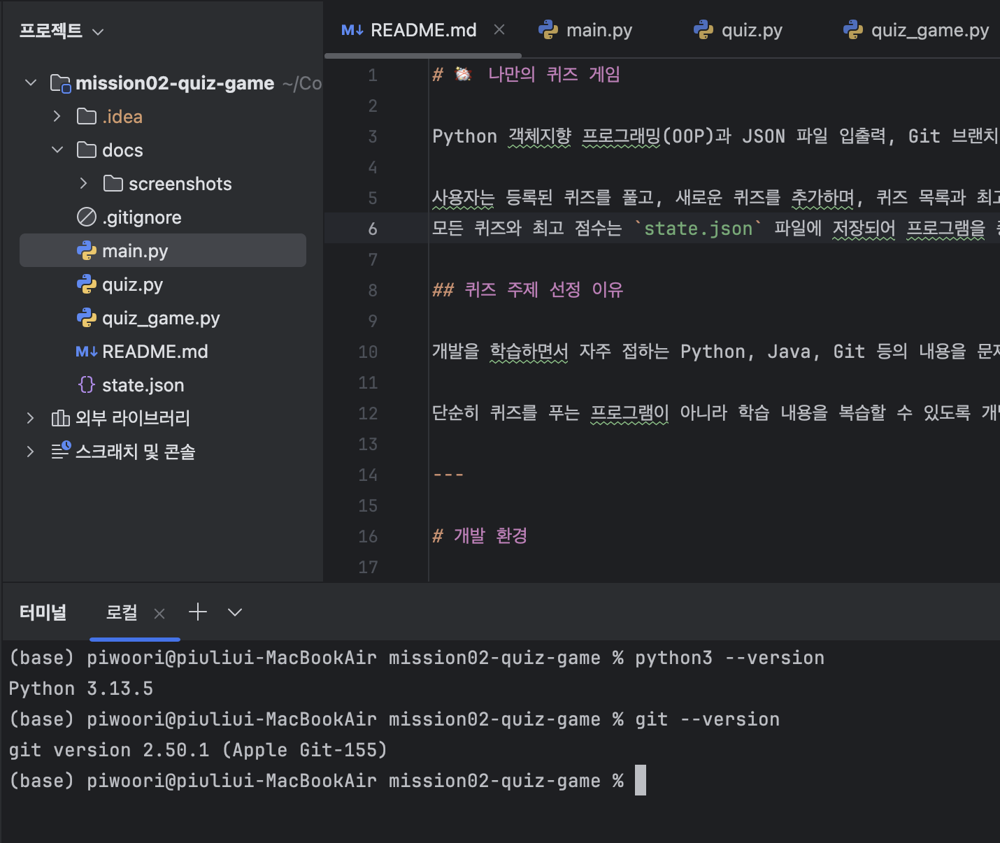

---

# 실행 방법

프로젝트를 복제합니다.

```bash
git clone https://github.com/piwoori/mission02-quiz-game.git
```

프로젝트 폴더로 이동합니다.

```bash
cd mission02-quiz-game
```

다음 명령어로 프로그램을 실행합니다.

```bash
python3 main.py
```

별도의 외부 라이브러리를 사용하지 않으므로 추가 패키지 설치는 필요하지 않습니다.

---

# 주요 기능

## 1. 메인 메뉴

사용자가 원하는 기능을 선택할 수 있는 메인 메뉴를 제공합니다.

- 퀴즈 풀기
- 퀴즈 추가
- 퀴즈 목록
- 점수 확인
- 종료

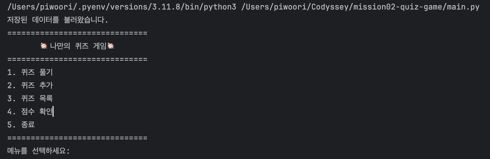

---

## 2. 퀴즈 풀기

등록된 모든 퀴즈를 객관식 4지선다 형식으로 풀 수 있습니다.

- 문제와 선택지 4개 출력
- 정답 번호 입력
- 정답 및 오답 판별
- 오답인 경우 실제 정답 출력
- 최종 점수 계산
- 최고 점수 갱신
- 숫자가 아니거나 범위를 벗어난 입력 처리

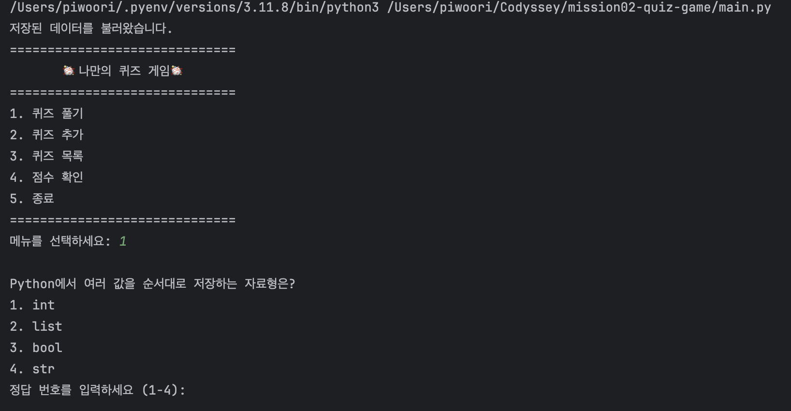

### 결과 화면

모든 문제를 풀면 맞힌 문제 수와 최고 점수를 출력합니다.

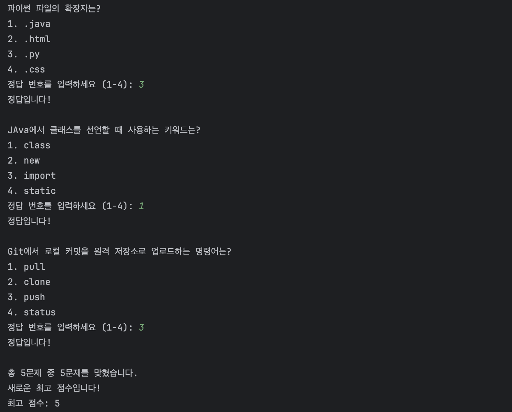

---

## 3. 퀴즈 추가

사용자가 직접 새로운 퀴즈를 등록할 수 있습니다.

입력 항목은 다음과 같습니다.

- 문제
- 선택지 4개
- 정답 번호

문제와 선택지에는 빈 값을 입력할 수 없으며, 정답 번호는 1부터 4까지의 숫자만 입력할 수 있습니다.

추가된 퀴즈는 `state.json` 파일에 즉시 저장됩니다.

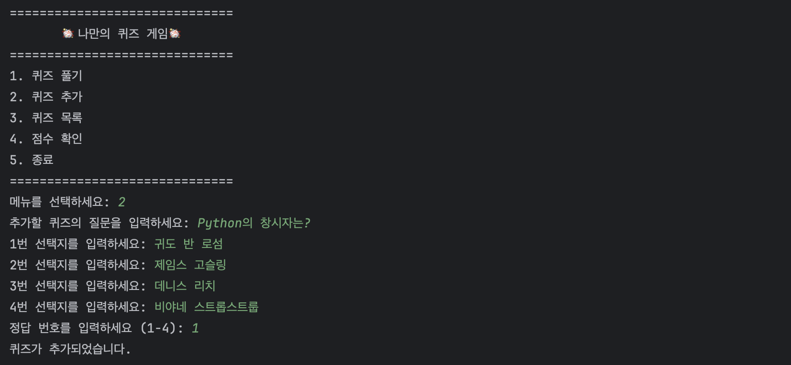

---

## 4. 퀴즈 목록 조회

현재 등록된 모든 퀴즈의 번호와 문제를 확인할 수 있습니다.

등록된 퀴즈가 없는 경우에는 별도의 안내 문구를 출력합니다.

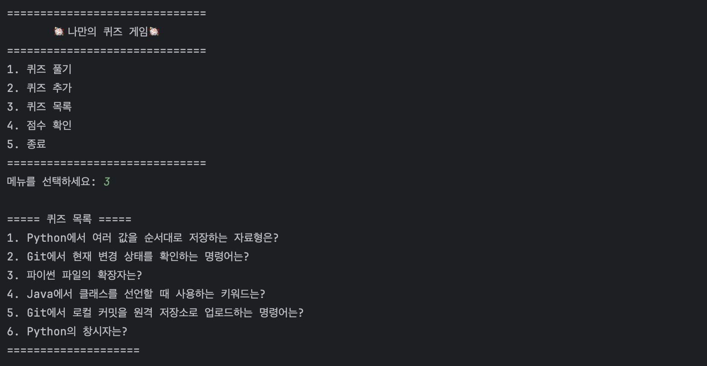

> **추가 캡처 권장:** 등록된 퀴즈가 없을 때의 안내 화면  
> 권장 파일명: `docs/screenshots/empty-quiz-list.png`

---

## 5. 최고 점수 조회

현재 저장된 최고 점수를 확인할 수 있습니다.

아직 퀴즈를 한 번도 풀지 않은 경우에는 다음과 같은 별도의 안내 문구를 출력합니다.

```text
아직 퀴즈를 풀지 않았습니다.
```

퀴즈를 풀고 0점을 받은 경우에는 최고 점수 0점을 정상적으로 표시합니다.

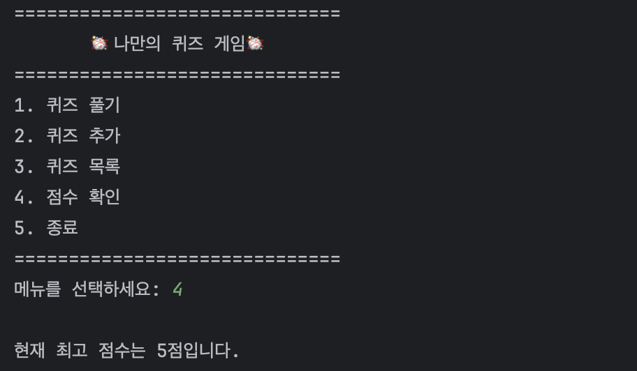

> **추가 캡처 필요:** 퀴즈를 한 번도 풀지 않은 상태에서 점수 확인 메뉴를 실행한 화면  
> 권장 파일명: `docs/screenshots/no-score-yet.png`

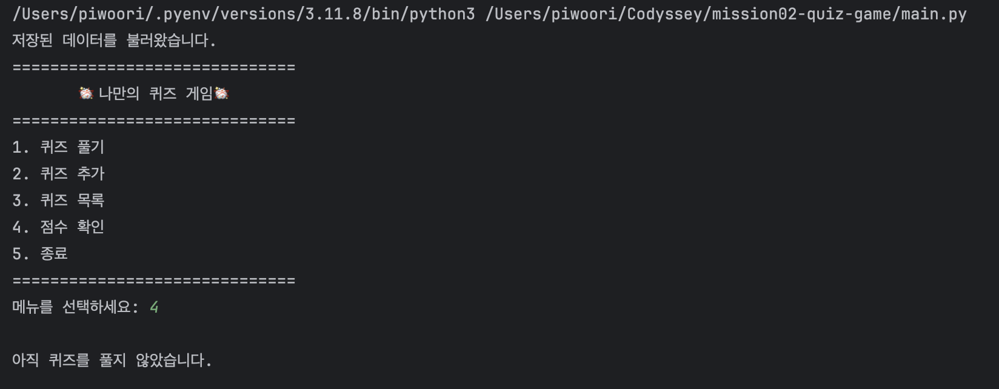

---

## 6. JSON 데이터 저장 및 불러오기

퀴즈 목록, 최고 점수, 퀴즈 풀이 여부는 `state.json` 파일에 저장됩니다.

프로그램을 다시 실행하면 기존 데이터를 불러오기 때문에 이전에 추가한 퀴즈와 최고 점수가 유지됩니다.

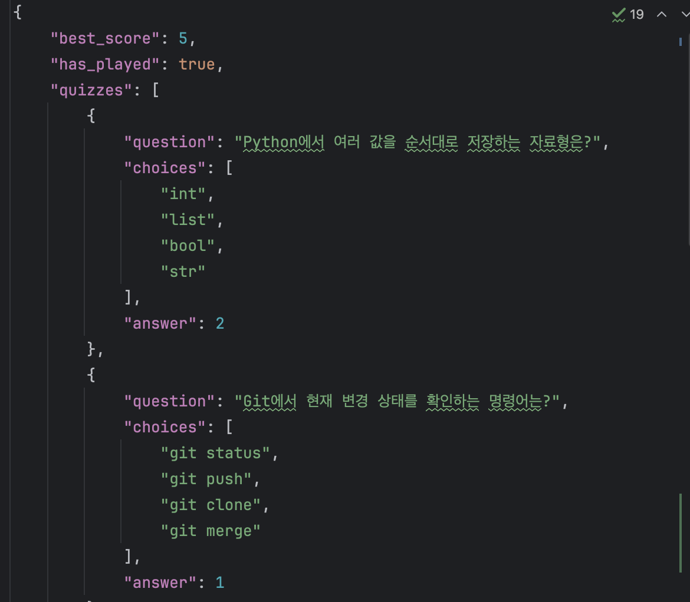

---

## 7. 입력 및 예외 처리

잘못된 입력이나 파일 오류로 인해 프로그램이 비정상적으로 종료되지 않도록 예외 처리를 구현했습니다.

### 사용자 입력 처리

- 메뉴의 빈 입력
- 메뉴 범위를 벗어난 입력
- 숫자가 아닌 메뉴 입력
- 문제 및 선택지의 빈 입력
- 정답 번호의 빈 입력
- 숫자가 아닌 정답 입력
- 1부터 4까지의 범위를 벗어난 정답 번호

### 파일 관련 예외 처리

- JSON 파일이 존재하지 않는 경우
- JSON 파일이 손상된 경우 (`JSONDecodeError`)
- JSON 데이터 구조가 잘못된 경우 (`KeyError`, `TypeError`)
- 파일 읽기 및 쓰기 오류 (`OSError`)

### 프로그램 입력 중단 처리

- `KeyboardInterrupt` (`Ctrl+C`)
- `EOFError`

입력이 중단되면 현재 데이터를 저장한 후 프로그램을 종료합니다.

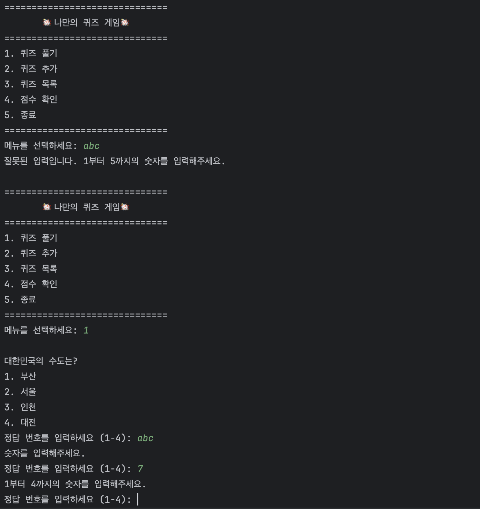

> **추가 캡처 필요:** 손상된 `state.json`을 기본 퀴즈 데이터로 복구하는 화면  
> 권장 파일명: `docs/screenshots/json-recovery.png`

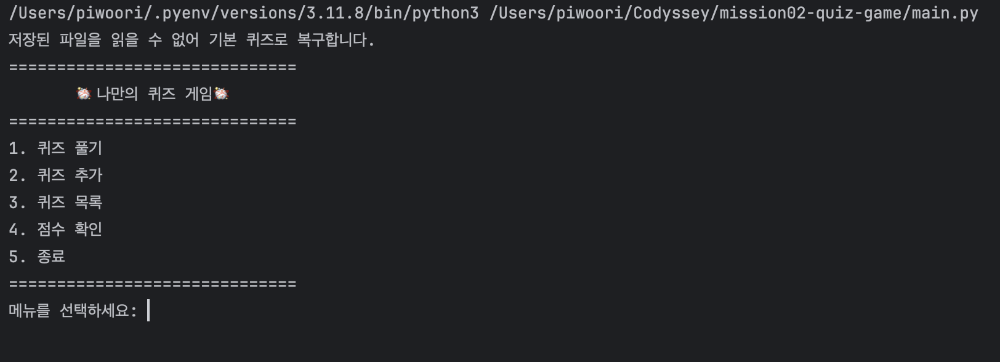

---

# 프로젝트 구조

```text
mission02-quiz-game
│
├── docs/
│   └── screenshots/
│       ├── add-quiz.png
│       ├── best-score.png
│       ├── invalid-answer.png
│       ├── main-menu.png
│       ├── play-quiz.png
│       ├── quiz-list.png
│       ├── quiz-result.png
│       └── state-json.png
│
├── .gitignore
├── main.py
├── quiz.py
├── quiz_game.py
├── state.json
└── README.md
```

| 파일 및 폴더 | 설명 |
|---|---|
| `.gitignore` | Git에서 추적하지 않을 파일과 폴더 설정 |
| `main.py` | 프로그램 실행, 메뉴 입력 및 기능 호출 |
| `quiz.py` | 개별 퀴즈를 표현하는 `Quiz` 클래스 |
| `quiz_game.py` | 퀴즈 게임의 전체 기능을 관리하는 `QuizGame` 클래스 |
| `state.json` | 퀴즈 목록, 최고 점수 및 풀이 여부 저장 |
| `docs/screenshots/` | README에 사용하는 실행 화면 이미지 |
| `README.md` | 프로젝트 설명 및 실행 방법 |

---

# 클래스 구조

## Quiz 클래스

객관식 퀴즈 한 문제의 데이터와 동작을 관리합니다.

```text
Quiz
├── question
├── choices
├── answer
│
├── display()
└── check_answer()
```

### 속성

| 속성 | 설명 |
|---|---|
| `question` | 퀴즈 문제 |
| `choices` | 선택지 4개가 저장된 리스트 |
| `answer` | 정답 번호 |

### 메서드

| 메서드 | 설명 |
|---|---|
| `display()` | 문제와 선택지 4개 출력 |
| `check_answer()` | 사용자의 답과 실제 정답 비교 |

---

## QuizGame 클래스

퀴즈 목록, 게임 진행, 점수 및 JSON 데이터를 관리합니다.

```text
QuizGame
├── quizzes
├── best_score
├── has_played
├── file_name
│
├── show_menu()
├── play_quiz()
├── add_quiz()
├── input_not_empty()
├── add_default_quizzes()
├── show_quizzes()
├── show_best_score()
├── save_data()
└── load_data()
```

### 속성

| 속성 | 설명 |
|---|---|
| `quizzes` | `Quiz` 객체가 저장된 리스트 |
| `best_score` | 사용자의 최고 점수 |
| `has_played` | 퀴즈를 한 번 이상 풀었는지 여부 |
| `file_name` | `state.json` 파일의 절대 경로 |

### 메서드

| 메서드 | 설명 |
|---|---|
| `show_menu()` | 메인 메뉴 출력 |
| `play_quiz()` | 등록된 퀴즈 풀이 및 점수 계산 |
| `add_quiz()` | 새로운 퀴즈 입력 및 추가 |
| `input_not_empty()` | 빈 문자열이 아닌 값 입력 |
| `add_default_quizzes()` | 기본 퀴즈 5개 생성 |
| `show_quizzes()` | 등록된 퀴즈 목록 출력 |
| `show_best_score()` | 최고 점수 또는 미응시 상태 출력 |
| `save_data()` | 현재 데이터를 JSON 파일에 저장 |
| `load_data()` | JSON 파일에서 기존 데이터 불러오기 |

---

# 기본 퀴즈 데이터

프로그램을 처음 실행해 `state.json` 파일이 존재하지 않는 경우, 개발 관련 기본 퀴즈 5개를 생성합니다.

기본 퀴즈의 주제는 다음과 같습니다.

- Python 자료형
- Git 상태 확인 명령어
- Python 파일 확장자
- Java 클래스 선언
- Git 원격 저장소 업로드 명령어

각 퀴즈는 다음 정보를 포함합니다.

- 문제
- 선택지 4개
- 정답 번호

모든 기본 퀴즈는 `Quiz` 클래스의 인스턴스로 생성합니다.

---

# JSON 저장 구조

`state.json` 파일에는 최고 점수, 퀴즈 풀이 여부, 퀴즈 목록이 저장됩니다.

```json
{
    "best_score": 5,
    "has_played": true,
    "quizzes": [
        {
            "question": "Python에서 여러 값을 순서대로 저장하는 자료형은?",
            "choices": [
                "int",
                "list",
                "bool",
                "str"
            ],
            "answer": 2
        }
    ]
}
```

| 항목 | 설명 |
|---|---|
| `best_score` | 현재까지 기록한 최고 점수 |
| `has_played` | 퀴즈를 한 번 이상 풀었는지 여부 |
| `quizzes` | 퀴즈 데이터 목록 |
| `question` | 퀴즈 문제 |
| `choices` | 선택지 4개 |
| `answer` | 정답 번호 |

---

# 파일 경로 관리

실행 위치에 따라 서로 다른 위치에 `state.json` 파일이 생성되는 문제를 방지하기 위해 `pathlib.Path`를 사용했습니다.

```python
project_root = Path(__file__).resolve().parent
self.file_name = project_root / "state.json"
```

이를 통해 프로그램을 어느 경로에서 실행하더라도 프로젝트 폴더의 `state.json` 파일을 사용합니다.

---

# Git 브랜치 전략

기능별 브랜치를 생성하여 작업한 후 `main` 브랜치에 병합했습니다.

```text
main
│
└── feature/json
      │
      ├── JSON 저장
      ├── JSON 불러오기
      ├── JSON 예외 처리
      └── 객관식 구조 리팩터링
```

기능 구현 과정에서 커밋을 기능 단위로 구분하고, 브랜치 병합을 통해 작업 이력을 관리했습니다.

> **추가 캡처 필요:** `git log --oneline --graph --all` 실행 결과 또는 SourceTree 커밋 그래프  
> 권장 파일명: `docs/screenshots/git-log-graph.png`

```bash
git log --oneline --graph --all
```

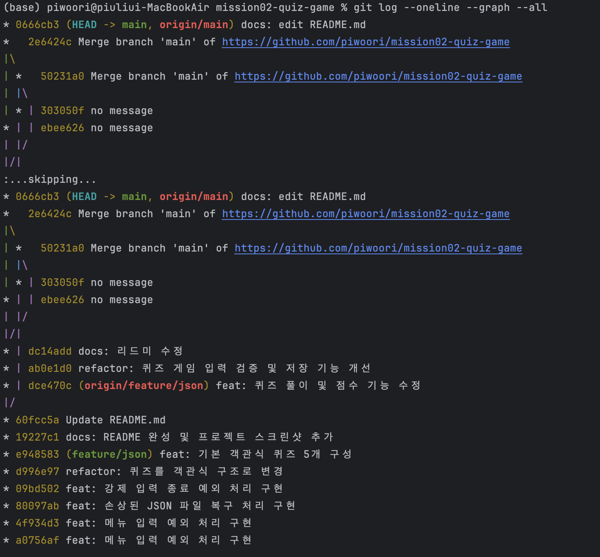

---

# Git Clone 및 Pull 실습

다른 작업 환경에서 원격 저장소를 복제하기 위해 `git clone`을 사용했습니다.

```bash
git clone https://github.com/piwoori/mission02-quiz-game.git
```

복제한 저장소에서 변경사항을 Commit 및 Push한 뒤, 기존 작업 환경에서는 Pull을 실행하여 최신 변경사항을 반영했습니다.

```bash
git pull origin main
```

> **추가 캡처 필요:** 다른 작업 환경에서 Clone한 화면 또는 SourceTree 저장소 복제 화면  
> 권장 파일명: `docs/screenshots/git-clone.png`

> **추가 캡처 필요:** 기존 작업 환경에서 Pull을 실행하여 변경사항이 반영된 화면  
> 권장 파일명: `docs/screenshots/git-pull.png`

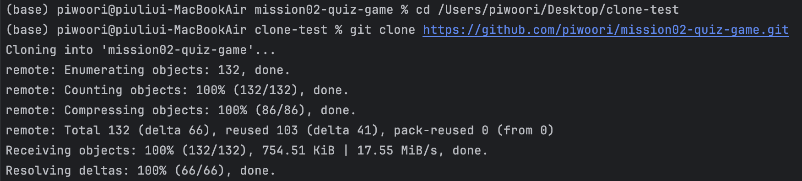


---

# 트러블슈팅

## 1. 서로 다른 환경에서 JSON 데이터가 달라지는 문제

두 대의 Mac에서 프로젝트를 작업하면서 각 환경에 서로 다른 `state.json` 파일이 생성되어, 추가한 퀴즈와 최고 점수가 다르게 보이는 문제가 발생했습니다.

### 원인

각 환경에서 별도로 생성된 `state.json` 파일의 내용이 자동으로 동기화되지 않았습니다.

### 해결

- `state.json`을 Git에서 함께 관리했습니다.
- 다른 환경에서 작업하기 전에 Pull을 실행했습니다.
- 작업을 완료한 후 Commit과 Push를 수행했습니다.
- 두 환경에서 동시에 `state.json`을 수정하지 않도록 작업 순서를 관리했습니다.

---

## 2. 실행 위치에 따라 JSON 파일 위치가 달라지는 문제

상대 경로만 사용하면 프로그램을 실행한 터미널의 현재 위치에 따라 다른 위치에 `state.json`이 생성될 수 있었습니다.

### 해결

`pathlib.Path`를 사용하여 `quiz_game.py` 파일이 위치한 프로젝트 폴더를 기준으로 JSON 파일의 절대 경로를 생성했습니다.

```python
project_root = Path(__file__).resolve().parent
self.file_name = project_root / "state.json"
```

---

## 3. 손상된 JSON 파일로 인해 프로그램이 종료되는 문제

`state.json` 파일의 JSON 형식이 잘못되면 `json.load()` 과정에서 프로그램이 종료되는 문제가 있었습니다.

### 해결

`json.JSONDecodeError`를 비롯한 파일 및 데이터 관련 예외를 처리했습니다.

오류가 발생한 경우 다음 작업을 수행합니다.

- 기존 퀴즈 목록 초기화
- 최고 점수 초기화
- 퀴즈 풀이 여부 초기화
- 기본 퀴즈 5개 복구
- 정상적인 JSON 파일 재생성

---

## 4. 다른 Mac에서 GitHub Push 인증이 실패한 문제

다른 Mac의 SourceTree에서 Push를 시도했을 때 다음과 같은 인증 오류가 발생했습니다.

```text
remote: Invalid username or token.
Password authentication is not supported for Git operations.
```

### 원인

GitHub는 Git 작업에서 일반 계정 비밀번호 인증을 지원하지 않으며, SourceTree에 저장된 인증 정보가 유효하지 않았습니다.

### 해결

- SourceTree에서 GitHub 계정을 다시 연결했습니다.
- 기존에 저장된 잘못된 인증 정보를 제거했습니다.
- GitHub OAuth 또는 Personal Access Token을 사용해 다시 인증했습니다.

> **추가 캡처 권장:** SourceTree에서 정상적으로 Push가 완료된 화면  
> 권장 파일명: `docs/screenshots/push-success.png`

---

# 실행 테스트

다음 항목을 기준으로 프로그램을 테스트했습니다.

- 프로그램 첫 실행 시 기본 퀴즈 5개 생성
- 메인 메뉴 1부터 5까지 정상 실행
- 빈 메뉴 입력 처리
- 잘못된 메뉴 번호 처리
- 퀴즈 정답 및 오답 판별
- 퀴즈 추가 후 JSON 즉시 저장
- 프로그램 재실행 후 추가한 퀴즈 유지
- 최고 점수 갱신 및 유지
- 미응시 상태와 0점 상태 구분
- 손상된 JSON 파일 복구
- `Ctrl+C` 입력 시 데이터 저장 후 종료

> **추가 캡처 필요:** 최종 프로그램 실행 결과가 한 화면에 보이는 캡처  
> 권장 파일명: `docs/screenshots/final-run.png`


---

# 배운 점

이번 프로젝트를 통해 다음 내용을 학습했습니다.

- Python 클래스와 객체지향 프로그래밍
- 클래스별 역할과 책임 분리
- 생성자 `__init__`
- 리스트와 반복문
- `enumerate()`
- 입력값 검증
- JSON 저장 및 불러오기
- 파일 입출력
- 예외 처리
- `pathlib`을 이용한 파일 경로 관리
- Git 브랜치 생성 및 병합
- Git Clone, Pull, Commit, Push
- SourceTree를 활용한 Git 관리
- 서로 다른 개발 환경에서 작업 내용을 동기화하는 방법